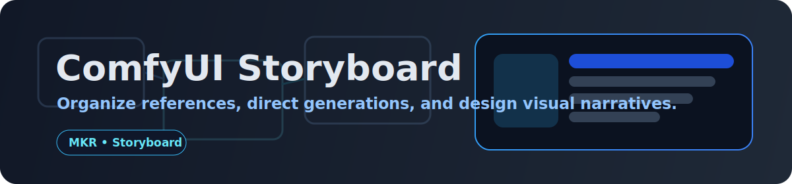

# ComfyUI Storyboard Workspace

A PureRef-inspired storyboard and reference board for ComfyUI. This extension provides an infinite canvas where you can collect references, organize shots, and target generations directly into placeholders.

## Features

- **Infinite Canvas**: Pan and zoom workspace for organizing your creative process.
- **Direct Import**: Drag and drop local images or paste images/URLs directly into the workspace.
- **Workflow Integration**: 
    - **Generate to Selected**: Run a workflow and have the output land directly in a selected slot or item.
    - **Upstream Producer**: Send images to the board via tags or placeholder IDs.
    - **Downstream Consumer**: Pull curated images or batches from the board back into your workflow (e.g., for IPAdapter or control nets).
- **Organization Tools**: 
    - **Slots**: Create empty generation targets.
    - **Notes**: Add sticky notes for context and planning.
    - **Z-Order**: Bring items to front or send to back.
    - **Inspector**: Edit labels and tags for any item.

## Nodes

### 🎨 Storyboard
The main workspace node. 
- **Open Storyboard**: Launches the workspace window.
- **Action**: Can be used to programmatically clear the board.
- **Board ID**: Supports multiple independent boards.

### 🎨 Storyboard Send
Pushes images into a storyboard.
- **Target Mode**: `selected`, `placeholder_id`, `tag`, or `new_item`.
- **Target**: The ID or tag to match.
- **Append Mode**: Choose to replace or append to the target.

### 🎨 Storyboard Read
Reads images/data from a board.
- **Read Mode**: `first_selected`, `all_selected_batch`, `by_tag`, etc.
- **Tag Filter**: Filter items by their assigned tags.

### 🎨 Storyboard Slot
Creates named empty placeholders in the board.

## Installation

1. Clone this repository into your `ComfyUI/custom_nodes/` directory.
2. Restart ComfyUI.

## Usage

1. Add a **Storyboard** node to your graph.
2. Click **Open Storyboard** to open the workspace.
3. Drag in some images or add a **Slot**.
4. Use **Storyboard Send** in your generation pipe to target your board items.
5. Use **Storyboard Read** to feed board items into other nodes.

---

